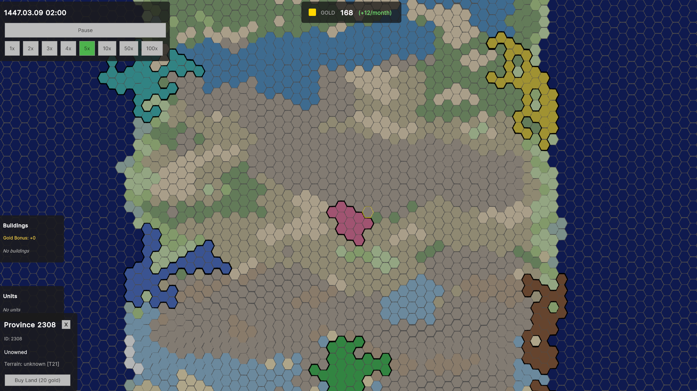
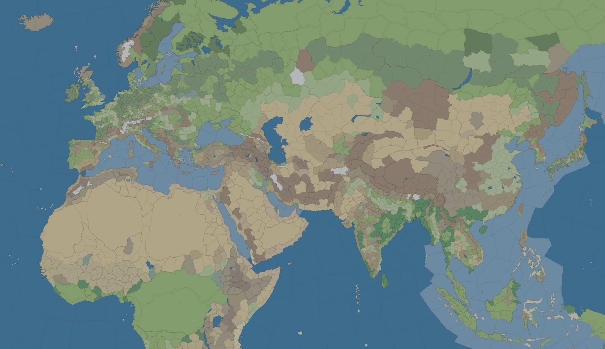

# Archon Engine

A Unity-based game engine for grand strategy games, built around a dual-layer architecture that separates deterministic simulation from GPU-accelerated presentation.


APIs should be stable by 2026 Q1. Until a release pops up, production use is discouraged.

**Quick Links:**
- [Getting Started](Docs/Wiki/Getting-Started.md) - Setup and first steps
- [Your First Game](Docs/Wiki/Your-First-Game.md) - Build a working game
- [Cookbook](Docs/Wiki/Cookbook.md) - Quick API recipes
- [Architecture Overview](Docs/Engine/ARCHITECTURE_OVERVIEW.md) - System design
- [Feature List](Docs/CURRENT_FEATURES.md) - Complete feature list

**Note:** Game data (maps, scenarios) is not included - you'll need to provide your own or use the StarterKit's template data.


2D map loaded using Europa Universalis 4 data.

## Why

Grand strategy is notorious for being extremely complex. Even for experienced studios it's a daunting task to set everything up. It essentially has given monopoly to Paradox, with only exceptionally few coming close to their quality and scale. And for good reason.

Some extreme hurdles for Paradox-like grand strategy:
- Vector like graphics to scale infinitely
- Create beautiful maps from simple bitmaps/pngs
- Fixed-Point arithmetic & deterministic simulation
- Data oriented design (not OOP)
- AI, Diplomacy, Military, Economy as core pillars
- Modifiers, resources, relations, unit movements, sparse storage
- Modding capability

I could go on.

Archon-Engine is designed to be generic infrastructure, providing everything you need from day 1. You can focus on creating content rather than researching the 1% topics barely anyone knows about.

**This not a dunk on Paradox.** I love their games. I just wish they didn't lag so goddamn much.

**This does NOT mean it will be easy developing.** I've tried my best to make it approachable with Wiki, StarterKit, API page, various docs etc. However Grand Strategy is inherently complex and it will still take a LONG time to get going.

## Installation

### Option 1: Git Submodule (Recommended)
```bash
cd YourUnityProject/Assets
git submodule add https://github.com/YourUsername/Archon-Engine.git Archon-Engine
```

### Option 2: Manual Download
1. Download/clone the repository
2. Copy the `Archon-Engine` folder into your Unity project's `Assets/` folder

### After Installation
1. Open your Unity project - let it import and compile
2. Install required package: **Window → Package Manager → + → Add by name** → `com.unity.nuget.newtonsoft-json`
3. Open the StarterKit scene: `Assets/Archon-Engine/Scenes/StarterKit.unity`
4. Press Play to verify everything works

### Requirements
- Unity 6000+ (2023.3+, latest LTS recommended)
- Universal Render Pipeline (URP)
- Burst Compiler enabled
- UI Toolkit

## Core Architecture

**Dual-Layer Design**
```
┌──────────────────────────────────┐
│   Map Layer (Presentation)       │
│   - Texture-based rendering      │
│   - GPU compute shaders          │
│   - Single draw call             │
└───────────┬──────────────────────┘
            │ Events (one-way)
            ↓
┌──────────────────────────────────┐
│   Core Layer (Simulation)        │
│   - 8-byte province structs      │
│   - Fixed-point deterministic    │
│   - Command pattern              │
└──────────────────────────────────┘
```

**Key Design Decisions**
- **Fixed-size data**: 8-byte `ProvinceState` structs prevent late-game performance degradation
- **Deterministic math**: Fixed-point calculations (no floats) for multiplayer-ready simulation
- **Texture-based map**: Provinces rendered as pixels, not GameObjects (single draw call)
- **GPU compute shaders**: All visual processing (borders, effects) on GPU
- **Command pattern**: All state changes go through commands for determinism and networking
- **Zero allocations**: Hot paths use pre-allocated memory and value types

## What Makes This Different

**Memory Efficiency:**
- 8-byte province structs: 10,000 provinces = 80KB hot data
- Hot/cold data separation for cache-friendly access
- Zero-allocation EventBus (99.99% allocation reduction)

**Rendering Performance:**
- Single draw call for entire map
- 3D MAP TO BE DETERMINED

**Multiplayer-Ready Architecture:**
- Deterministic fixed-point math (no floats in simulation)
- Command pattern for all state changes
- Built for lockstep synchronization from day one

**Tested with ~4,000 provinces:**
- Province updates: 0.24ms (target: <5ms)
- EventBus: 0.85ms, zero allocations
- Fixed-point math: 0.13ms for 10k calculations
- Memory stability: Stable over 400+ simulated years

## Structure

```
Assets/Archon-Engine/
├── Scripts/
│   ├── Core/           # Deterministic simulation layer
│   ├── Map/            # GPU-accelerated presentation
│   └── StarterKit      # Scripts to start from/look at
├── Shaders/            # Compute shaders for rendering
└── Docs/

    ├── Engine/         # Architecture documentation
    ├── Planning/       # Future features
    └── Log/            # Development journal
```

## StarterKit

A complete 7,000+ line game template demonstrating all ENGINE patterns. Use it as a learning reference or starting point for new games.

**Scene:** `Assets/Archon-Engine/Scenes/StarterKit.unity`

**What's Included:**
- **EconomySystem** - Gold economy with province income and building bonuses
- **UnitSystem** - Military units with movement, and visualization
- **BuildingSystem** - Province buildings with construction and effects
- **AISystem** - Goal-oriented AI (economy, expansion)
- **DiplomacySystem** - War, peace, relations, and opinion modifiers
- **Command Pattern** - All state changes through validated commands
- **Map Modes** - Political, economic, diplomatic visualization
- **UI Components** - Country selection, resource bar, province info, unit management, tooltips

**Data Files:**
- Unit types: `Template-Data/units/*.json5`
- Building types: `Template-Data/buildings/*.json5`

See [Scripts/StarterKit/README.md](Scripts/StarterKit/README.md) for implementation details.


*Template data shown - provide your own game data for production use.*

## Development Status

**Core Engine (Complete):**
- Dual-layer architecture with hot/cold data separation
- Province, Country, Diplomacy, Unit, and Pathfinding systems
- Resource & modifiers system
- Save/load system with command pattern
- Zero-allocation EventBus and performance optimizations
- AI system with goal-oriented behavior

**Map Layer (In Progress):**

As in, practical implementation of core systems.

- Vector like borders, razor thin
- 3D terrain tessallation and smart texturing for realistic terrain


*Simple province terrain, auto terrain assignment from texture*

**Planned Features:**
- Multiplayer (lockstep command synchronization)
- Modding API (scripting support)

## Documentation

**Getting Started:**
- [Getting Started](Docs/Wiki/Getting-Started.md) - Installation and setup
- [Your First Game](Docs/Wiki/Your-First-Game.md) - Step-by-step tutorial
- [Cookbook](Docs/Wiki/Cookbook.md) - Quick API recipes

**Feature Guides:** [Docs/Wiki/](Docs/Wiki/)
- Commands, Events, Economy, Buildings, Units, Map Modes
- AI, Diplomacy, Time System, Save/Load, Modifiers
- Queries, Pathfinding, Map Rendering, UI Patterns

**Troubleshooting:** [Docs/Wiki/](Docs/Wiki/)
- Performance issues, GPU/rendering, common mistakes

**Architecture:**
- [Architecture Overview](Docs/Engine/ARCHITECTURE_OVERVIEW.md) - Quick overview
- [Master Architecture](Docs/Engine/master-architecture-document.md) - Complete reference
- [Core FILE_REGISTRY](Scripts/Core/FILE_REGISTRY.md) - Core layer catalog
- [Map FILE_REGISTRY](Scripts/Map/FILE_REGISTRY.md) - Map layer catalog

## Screenshots


WIP 3D map with texturing


3D tessallated terrain WIP.

## License

MIT License - See [LICENSE](LICENSE) file for details.
