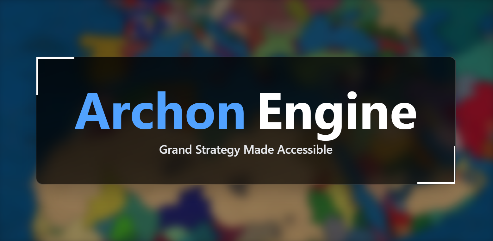
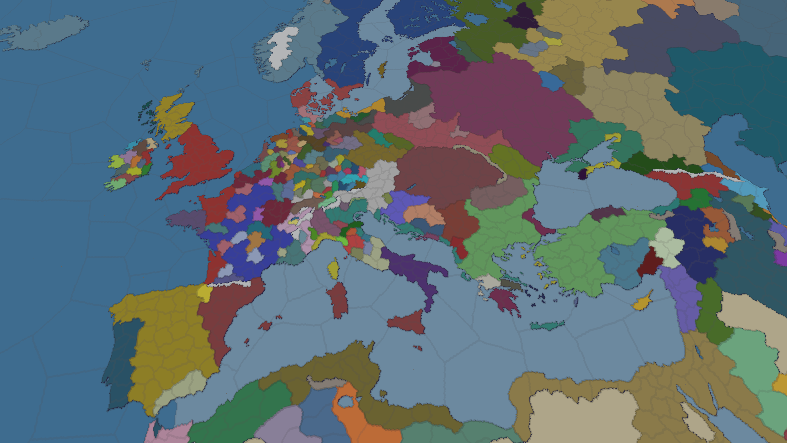

# Archon Engine

A Unity-based game engine for grand strategy games, built around a dual-layer architecture that separates deterministic simulation from GPU-accelerated presentation.



Documentation is approximately 1:1 with code size - architecture docs, session logs, and decision records. Many 1% topis covered in great detail.

APIs should be stable by 2026 Q1. Until a release pops up, production use is discouraged. Free open-source game demo will be released in 2026 Q2 to showcase practical integration.

**GAME DATA IS NOT PROVIDED IN PROJECT!**

**Quick Links:**
- [Docs/Engine/ARCHITECTURE_OVERVIEW.md](Docs/Engine/ARCHITECTURE_OVERVIEW.md) - Architecture overview
- [Docs/CURRENT_FEATURES.md](Docs/CURRENT_FEATURES.md) - Complete feature list


2D map loaded using Europa Universalis 4 data.

## Why

Grand strategy is notorious for being extremely complex. Even for experienced studios it's a daunting task to set everything up. It essentially has given monopoly to Paradox, with only exceptionally few coming close to their quality and scale. And for good reason.

Some extreme hurdles for Paradox-like grand strategy:
- Vector like graphics to scale infinitely
- Create beautiful maps from simple bitmaps/pngs
- Fixed-Point arithmetic & deterministic simulation
- Data oriented design (not OOP)
- AI, Diplomacy, Military, Economy as core pillars
- Modifiers, resources, relations, unit movements, sparse storage
- Modding capability

I could go on.

Archon-Engine is designed to be generic infrastructure, providing everything you need from day 1. You can focus on creating content rather than researching the 1% topics barely anyone knows about.

**This not a dunk on Paradox.** I love their games. I just wish they didn't lag so goddamn much.

## Core Architecture

**Dual-Layer Design**
```
┌─────────────────────────────────┐
│   Map Layer (Presentation)      │
│   - Texture-based rendering      │
│   - GPU compute shaders          │
│   - Single draw call             │
└───────────┬─────────────────────┘
            │ Events (one-way)
            ↓
┌─────────────────────────────────┐
│   Core Layer (Simulation)       │
│   - 8-byte province structs      │
│   - Fixed-point deterministic    │
│   - Command pattern              │
└─────────────────────────────────┘
```

**Key Design Decisions**
- **Fixed-size data**: 8-byte `ProvinceState` structs prevent late-game performance degradation
- **Deterministic math**: Fixed-point calculations (no floats) for multiplayer-ready simulation
- **Texture-based map**: Provinces rendered as pixels, not GameObjects (single draw call)
- **GPU compute shaders**: All visual processing (borders, effects) on GPU
- **Command pattern**: All state changes go through commands for determinism and networking
- **Zero allocations**: Hot paths use pre-allocated memory and value types

## What Makes This Different

**Memory Efficiency:**
- 8-byte province structs: 10,000 provinces = 80KB hot data
- Hot/cold data separation for cache-friendly access
- Zero-allocation EventBus (99.99% allocation reduction)

**Rendering Performance:**
- Single draw call for entire map
- TO BE DETERMINED

**Multiplayer-Ready Architecture:**
- Deterministic fixed-point math (no floats in simulation)
- Command pattern for all state changes
- Built for lockstep synchronization from day one

**Tested with ~4,000 provinces:**
- Province updates: 0.24ms (target: <5ms)
- EventBus: 0.85ms, zero allocations
- Fixed-point math: 0.13ms for 10k calculations
- Memory stability: Stable over 400+ simulated years

## Structure

```
Assets/Archon-Engine/
├── Scripts/
│   ├── Core/           # Deterministic simulation layer
│   └── Map/            # GPU-accelerated presentation
├── Shaders/            # Compute shaders for rendering
└── Docs/
    ├── Engine/         # Architecture documentation
    ├── Planning/       # Future features
    └── Log/            # Development journal
```

## Development Status

**Core Engine (Complete):**
- Dual-layer architecture with hot/cold data separation
- Province, Country, Diplomacy, Unit, and Pathfinding systems
- Resource & modifiers system
- Save/load system with command pattern
- Zero-allocation EventBus and performance optimizations
- AI system with goal-oriented behavior

**Game Layer (In Progress):**

As in, practical implementation of core systems.

- Core pillars (Economy, Military, Diplomacy, AI)
- Vector like borders, razor thin
- 3D terrain tessallation and smart texturing for realistic terrain


3D tessallated terrain WIP.

**Planned Features:**
- Multiplayer (lockstep command synchronization)
- Modding API (C# scripting support)
- Advanced AI

## Development Methodology

I could not have started this project a couple years ago. You need very specific expertise to pull something like this off. For now, I'm just one guy.

With the advent of AI agents, I present the "AI CTO" model: one human architect defines the vision, constraints, and architecture, while AI handles implementation. This approach requires rigorous documentation discipline - every architectural decision is recorded as the instruction manual and institutional memory for AI.

**Key to scalability:**
- Architecture documents defines immutable constraints (8-byte structs, deterministic simulation)
- Session logs capture pivotal moments and implementations
- FILE_REGISTRY & CURRENT_FEATURES documents catalog all systems
- Documentation serves as the instruction manual for AI collaboration, preserves context

Documentation is not overhead, it's needed. That's why if you read the docs you'll notice the information dense principles over code examples. It's AI optimized formatting for fast lookup. But I'm not here to preach, the work speaks for itself. Make your own conclusions.

The project goal is twofold:
- Prove grand strategy with proper architecture does not lag lategame
- AI development can scale & handle complexity

Hot takes, I know. Find my hidden docs if you want full picture.

## Documentation

**Architecture:**
- [Docs/Engine/master-architecture-document.md](Docs/Engine/master-architecture-document.md) - Complete architecture
- [Docs/Engine/ARCHITECTURE_OVERVIEW.md](Docs/Engine/ARCHITECTURE_OVERVIEW.md) - Quick overview
- [Scripts/Core/FILE_REGISTRY.md](Scripts/Core/FILE_REGISTRY.md) - Core layer catalog
- [Scripts/Map/FILE_REGISTRY.md](Scripts/Map/FILE_REGISTRY.md) - Map layer catalog

## Screenshots


WIP 3D map. Figuring out how texturing with infinite scale works

## Technical Requirements

- Unity 2023.3+
- Universal Render Pipeline (URP)
- IL2CPP scripting backend
- Burst Compiler enabled

## License

MIT License - See [LICENSE](LICENSE) file for details.
